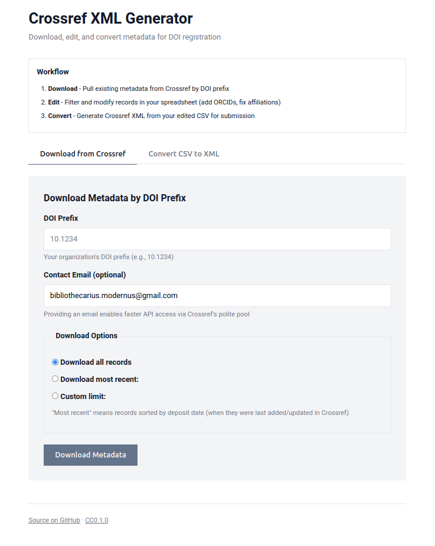

# Crossref XML Generator

Download, edit, and convert metadata for DOI registration.

A web-based tool for metadata librarians to manage Crossref submissions without navigating complex XML schemas or APIs. Pull existing DOI metadata, modify it in a spreadsheet, and generate valid Crossref 5.3.1 XML for submission.



## Use Cases

**Who uses this:**
- Metadata librarians managing institutional repositories
- Journal managers updating DOI records
- Repository administrators maintaining publisher metadata

**Common workflows:**
- **Bulk ORCID enrichment** — Download 500 article records, add author ORCIDs in Excel, resubmit to Crossref
- **ROR affiliation updates** — Pull existing metadata, append ROR identifiers to institutional affiliations, generate updated XML
- **Metadata corrections** — Fix author names, affiliations, or publication dates across multiple DOIs without manual XML editing
- **New DOI registration** — Create CSV from local records, add required Crossref fields, generate submission XML

**Why CSV as intermediate format:**
- Editable in Excel, Google Sheets, or any spreadsheet tool
- Supports bulk find-and-replace operations across hundreds of records
- No XML syntax knowledge required for metadata staff
- Version control friendly for tracking changes

## Requirements

- Python 3.8+
- Dependencies: see `requirements.txt`

## Setup

```bash
pip install -r requirements.txt
python app.py
```

Open `http://localhost:5000` in your browser.

## Usage

### Web Interface

1. **Download** — Enter a DOI prefix to pull existing metadata from Crossref
   - Choose to download all records or filter to most recent (100, 500, 1000, or custom limit)
2. **Edit** — Open the CSV in Excel/Sheets, filter to records needing updates, add ORCIDs, fix affiliations
3. **Convert** — Upload edited CSV to generate Crossref XML
4. **Submit** — Upload the XML to Crossref for DOI registration or updates

### Library

```python
from crossref_xml import download_prefix, generate_xml
import pandas as pd

# Download existing metadata
df = download_prefix('10.1234', email='you@example.org')
df.to_csv('my-dois.csv', index=False)

# Or download only most recent 500 records
df = download_prefix('10.1234', email='you@example.org', limit=500)
df.to_csv('my-dois.csv', index=False)

# After editing...
df = pd.read_csv('my-dois-edited.csv')
xml = generate_xml(
    data=df,
    depositor_name='Library Name',
    depositor_email='library@example.org',
    registrant='Library Name',
    include_references=True
)

with open('crossref-update.xml', 'w') as f:
    f.write(xml)
```

## CSV Format

### Required Columns

| Column | Description |
|--------|-------------|
| `doi` | The DOI being registered |
| `title` | Article title |
| `publication` | Journal or series name |
| `authors` | Semicolon-delimited author list |

### Optional Columns

| Column | Description |
|--------|-------------|
| `resource_url` | Landing page URL |
| `publication_date` | ISO format: `YYYY`, `YYYY-MM`, or `YYYY-MM-DD` |
| `volume` | Volume number |
| `issue` | Issue number |
| `pages` | Page range (e.g., `1-45`) |
| `abstract` | Article abstract |
| `issn_print` | Print ISSN |
| `issn_electronic` | Electronic ISSN |
| `pdf_url` | Direct PDF link (enables text mining) |
| `references` | JSON array of citations |

### Author Notation

Authors use `Surname, Given` format with optional bracketed metadata:

```
Chen, Maria ORCID[https://orcid.org/0000-0001-2345-6789] ORG[Riverside University] ROR[https://ror.org/abc123]
```

Multiple authors separated by semicolons:

```
Chen, Maria; Okonkwo, David ORG[Field Research Institute]
```

Multiple affiliations for one author:

```
Larsson, Erik ORG[Northern College; Marine Biology Center] ROR[https://ror.org/def456; https://ror.org/ghi789]
```

The download function automatically formats author data from Crossref in this notation.

### References Format

References stored as a JSON array:

```json
[
  {"key": "ref1", "DOI": "10.1234/cited.2020.001", "doi-asserted-by": "publisher"},
  {"key": "ref2", "unstructured": "Author, A. (2019). Title. Journal, 10(2), 45-67."}
]
```

See `docs/csv-guide.md` for detailed field documentation including transformation examples and edge cases.

## API Reference

### download_prefix(prefix, email=None, limit=None, sort_by='deposited') → DataFrame

Download works for a DOI prefix from Crossref API.

- `prefix`: DOI prefix (e.g., '10.1234')
- `email`: Optional contact email for Crossref polite pool (faster rate limits)
- `limit`: Optional maximum number of records to download (None = all records)
- `sort_by`: Field to sort by when limit is specified ('deposited', 'updated', 'indexed', 'published'). Defaults to 'deposited' for most recent records.

### generate_xml(data, depositor_name, depositor_email, registrant, include_references=False, license_url=None) → str

Generate Crossref 5.3.1 XML from DataFrame.

- `data`: DataFrame with required columns
- `depositor_name`: Organization registering the DOIs
- `depositor_email`: Contact email for registration issues
- `registrant`: Registrant identifier (usually same as depositor_name)
- `include_references`: Include citation list in output
- `license_url`: Optional metadata license URL (e.g., Creative Commons license). If None, no license element is added.

### validate_csv(df) → list

Check DataFrame for required columns. Returns list of error messages.

### parse_contributors(authors_str) → list

Parse author string with bracket notation into structured data.

## Validation

Before submitting to Crossref, validate your XML using the [Crossref Metadata Parser](https://www.crossref.org/02publishers/parser.html). This catches schema errors and malformed data before submission.

Spot-check a few records manually against your source data—automated transformations can propagate errors silently across hundreds of records.

## Limitations

- Maximum 500 records per XML batch (Crossref API limit)
- Journal articles only (no books, datasets, or conference papers)
- Generates XML for submission; does not submit directly to Crossref

## License

[CC0 1.0 Universal](LICENSE)
